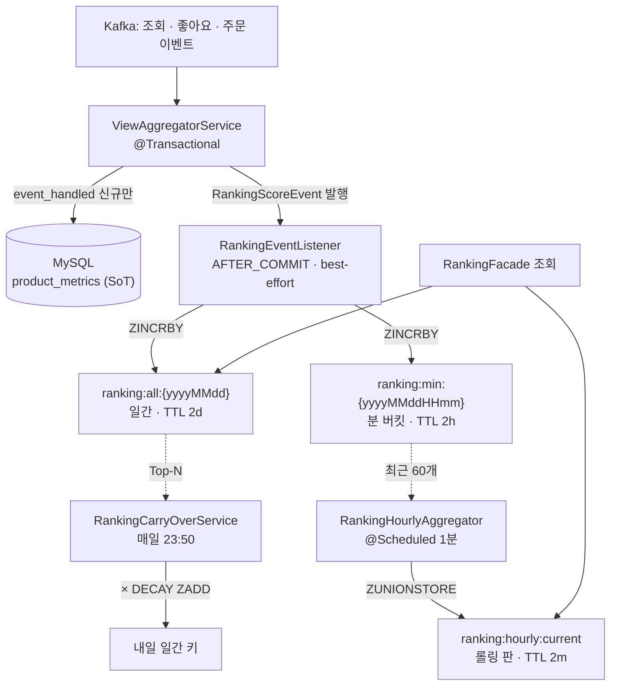
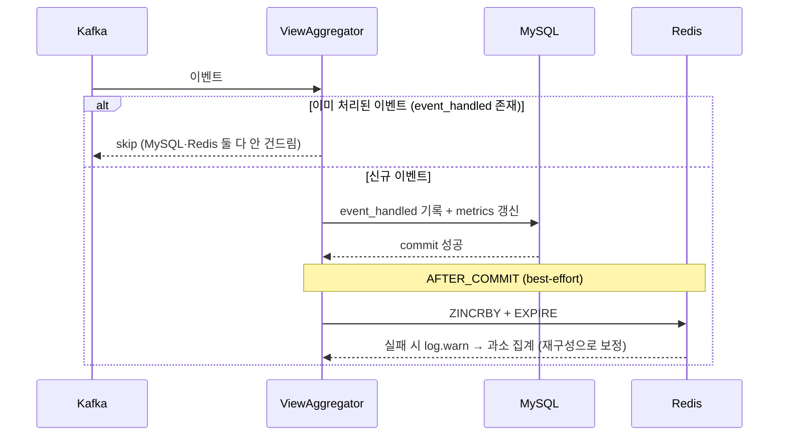
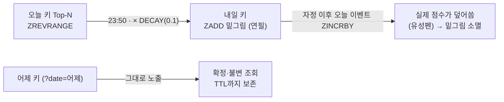
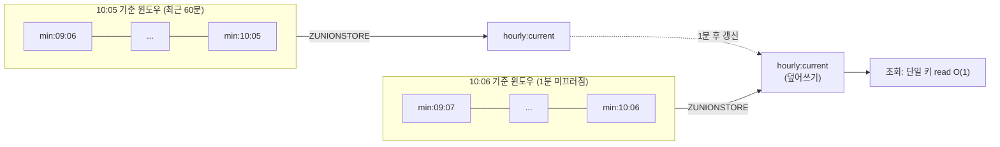

# [Design Doc] 이틀이면 버려질 랭킹에, 얼마를 투자할까 (N주차 · K팀 · 이름)

## TL;DR

랭킹 키에는 TTL이 걸려 **이틀이면 사라진다.** 이틀 뒤 버릴 데이터에 강한 즉시 일관성을
맞추는 건 과투자다. 그래서 정확성 대신 **"싸게 쓰고, 틀어지면 스스로 고친다"** 에
투자했다 — Redis 랭킹을 MySQL `product_metrics`의 **빠른 조회용 사본(이하 파생 뷰)** 으로
두고, 쓰기는 커밋 후 best-effort, 시간 단위 랭킹은 **분 버킷 + 1분 사전 합산**으로
구현했다. 이 "파생 뷰" 전제 하나가 TTL·콜드 스타트·실시간 랭킹 세 결정에서 매번 **더 싼
쪽**을 고르게 했다.

---

## Introduction & Goals

### Context / Background

Kafka Consumer가 조회·좋아요·주문 이벤트를 읽어 MySQL `product_metrics`에 **누적
카운트**를 적재하고 있었다. 하지만 누적 카운트는 일자 구분이 없어 "오늘의 인기상품"을
뽑을 수 없고, 매 조회마다 집계·정렬을 돌리면 비싸다. 그래서 Redis ZSET에 실시간 랭킹을
얹기로 했다.

문제는 이 랭킹이 **오래 사는 데이터가 아니라는 것**이다. 키에는 TTL이 걸려 이틀이면
만료된다. 그러면 설계 질문이 바뀐다 — "어떻게 완벽히 정확할까"가 아니라 **"이틀이면 버릴
데이터에, 무엇에 공을 들이고 무엇을 포기할까"** 다.

> **범위:** 이 문서에서 "랭킹"은 **일간·시간 단위의 실시간 랭킹**을 말한다.
> 주간·월간·연간·스테디셀러처럼 오래 사는 랭킹은 버려지는 Redis 파생 뷰가 아니라 **MySQL
> `product_metrics`의 누적 카운트에서 뽑는 별개 계층**이라, 버려지지도 best-effort도
> 아니다. 오히려 파생 뷰 전제가 이를 떠받친다 — **원본이 늘 MySQL에 있으니 어떤 기간이든
> 언제든 재구성할 수 있다.** 즉 이 설계는 긴 기간 랭킹을 *배제*하는 게 아니라 *가능하게*
> 한다.

전제를 먼저 세운 이유가 여기 있다 — **Redis 랭킹은 "파생 뷰"다.** 진실의 원천(SoT)은
MySQL `product_metrics`이고, ZSET은 그것을 빠르게 보여주는 사본일 뿐이다.

그래서 우리가 **택한 것**은 완벽한 정확성이 아니라 값싼 복원력이다 — **랭킹은 약간
틀려도 치명적이지 않고, MySQL 기준으로 재구성해 스스로 고칠 수 있다.** 아래 세
결정은 전부 이 기준에서 "더 싼 쪽"을 고른 결과다.

### Goals — 비용을 아끼되 이 넷은 반드시 지킨다

1. 이벤트가 발생하면 ZSET에 점수가 반영돼 **랭킹 페이지·상품 상세 순위**로 조회된다.
2. **재배달·재시작에도 점수가 중복 가산되지 않는다.**
3. 날짜가 바뀌어도 **과거 랭킹 조회가 정상 동작**한다.
4. "지난 1시간"처럼 시간이 흐르면 미끄러지는 실시간 랭킹을 **조회 부하 없이** 제공한다.

---

## Detailed Design

### System Architecture



> 쓰기를 일간·분 버킷에 fan-out → 1분 사전 합산 → 조회 흐름

핵심은 **쓰기와 조회 사이에 사전 합산 계층을 하나 끼운 것**이다. 조회 때마다 60개를
합치는 비싼 값을 매번 치르는 대신, 그 비용을 1분에 한 번으로 미리 몰아 지불한다. 이벤트는
1분 버킷에 잘게 쌓이고, 스케줄러가 1분마다 최근 60개 버킷을 한 판으로 합쳐 두면, 조회는
그 한 판만 읽는다.

### Data Models

| 키 | 용도 | TTL |
|---|---|---|
| `ranking:all:{yyyyMMdd}` | 일간 랭킹 | 이틀 |
| `ranking:min:{yyyyMMddHHmm}` | 분 버킷 — 시간 랭킹의 1분 양자화 봉투 | 2시간 |
| `ranking:hourly:current` | 최근 60분 사전 합산 — 조회용 롤링 판 | 2분 |

셋 다 짧게 살다 사라진다 — 그래서 어디에도 강한 일관성을 들이지 않는다. ZSET member는
`productId`, score는 신호별 기여의 누적이다.

```
조회   score += 0.1
좋아요 score += 0.2   (취소 시 -0.2)
주문   score += 0.6 × log10(1 + price × amount)
```

> 점수는 **순서만** 의미가 있어 double을 그대로 ZSET score로 쓴다. 가중치 0.1/0.2/0.6은
> `ranking.weight` 설정으로 뺐다.

### API Design

- `GET /api/v1/rankings?date={yyyyMMdd}` — 일간 랭킹, 과거 날짜 조회 포함
- `GET /api/v1/rankings/hourly` — 지난 1시간 실시간 랭킹, `ranking:hourly:current` 조회
- 상품 상세 응답에 해당 상품의 **랭킹 순위** 포함

### Constraints — 무엇을 들이지 않기로 했나

- **Redis는 파생 뷰, SoT는 MySQL.** 이틀이면 버릴 사본에 강한 즉시 일관성은 들이지 않는다.
- **쓰기는 커밋 후 best-effort.** Redis는 트랜잭션 롤백에 낄 수 없으므로,
  `@TransactionalEventListener(AFTER_COMMIT)`로 **MySQL 커밋 성공 후에만** 반영하고 실패는
  `log.warn`만 남긴다. 순서를 이렇게 고정해야 실패해도 **과소 집계**로만 끝난다 — 과다보다
  과소가 싸게 복구되고, 이후 재구성으로 보정한다.
- **멱등성은 `event_handled` 게이트 재사용.** 별도 추적 테이블을 새로 만드는 대신, Redis
  점수 반영을 dedup 체크를 통과한 신규 이벤트 분기 안에서만 등록한다. "처리한 사건 목록"
  문지기 하나가 MySQL·Redis 양쪽 중복을 동시에 막는다. `ZINCRBY`는 두 번 부르면 두 배가
  되기 때문이다.



> 커밋 후 best-effort 반영 — 순서를 "MySQL → Redis"로 고정해 최악이 과소 집계

---

## Alternatives Considered — 매번 "더 싼 쪽"을 골랐다

### 결정 1 — TTL: 언제 EXPIRE를 거는가

`ZINCRBY`는 점수만 더할 뿐 만료 시점을 정해주지 않는다. 안 걸면 날짜별 키가 매일 쌓여
메모리를 잡아먹는다.

| 옵션 | Pros | Cons |
|---|---|---|
| A. 키 최초 생성 시 1회만 EXPIRE | 명령 최소화 | 그 한 번이 실패·경합으로 누락되면 **영구 잔존**해 메모리 누수, "방금 새로 생겼나" 경합 처리 필요 |
| **선택: B. 매 이벤트마다 EXPIRE 갱신** | 이번에 실패해도 **다음 이벤트가 다시 걸어줌**, 분기·경합 없음 | 이벤트마다 명령 1회 추가 |

**선택 근거:** B는 거의 공짜인 명령 하나로 "만료 보장"을 얻는다. A는 더 싸 보이지만, 그 한
번이 실패하면 키가 영영 안 지워지는 **비싼 사고**로 돌아온다. B는 best-effort 전제와
맞물려 자가 치유가 공짜다 — 이번에 실패해도 다음 이벤트가 다시 걸어준다. 키가
`ranking:all:{yyyyMMdd}`로 날짜 고정이라 슬라이딩 우려도 없다 — 오늘 키의 마지막 이벤트는
늦어야 23:59 → 모레 23:59까지 유지돼 "과거 날짜 조회"를 오히려 확실히 만족한다.

**그럼 TTL 값은 왜 이틀인가?** 요구사항이 "오늘 + **어제** 랭킹 조회"다. 일간 키는
날짜별이라 어제 키가 **오늘 내내 살아있어야** 어제 랭킹을 조회할 수 있다. TTL은 매
이벤트로 갱신되니 키 수명은 "마지막 이벤트 + TTL"이고, 어제 키의 마지막 이벤트는 어제
23:59다.

| TTL | 어제 키 만료 시점 | 결과 |
|---|---|---|
| 1일 | 어제 23:59 + 1일 = **오늘 23:59** | 오늘 하루는 되지만 자정 경계·시계 오차·늦은 조회에 아슬아슬 |
| **이틀** | 어제 23:59 + 2일 = **모레 23:59** | 오늘 하루 내내 확실히 살아있고 **하루치 여유 버퍼** |

더 길게 잡으면 이틀이면 버릴 데이터를 괜히 오래 안고 있어 메모리 낭비다. 그래서 "어제까지
조회 보장 + 하루 여유"에 딱 맞는 **최소값이 이틀**이다.

### 결정 2 — 콜드 스타트: 자정 백지를 어떻게 출발시키는가

일간 키는 자정에 0점 백지로 열린다. 새벽엔 트래픽이 적어 손님 한 명의 조회 한 번이 곧바로
1등이 되는 믿기 어려운 순위가 된다.

| 옵션 | Pros | Cons |
|---|---|---|
| A. 완화 없음, 백지 시작 | 공짜 | 새벽 랭킹이 노이즈 |
| B. 어제 점수 그대로 복사 | 콜드 스타트 없음 | 어제 1등이 관성으로 오늘도 1등 → 신흥 인기가 못 올라옴 |
| **선택: C. 감쇠 Score Carry-Over** | 출발선 어드밴티지만 주고 승부는 오늘 이벤트로 가림 | 스케줄러·설정 추가 |

**선택 근거:** C는 스케줄러 하나라는 작은 값으로 "새벽 노이즈 제거"를 얻는다. A는 공짜지만
그 노이즈를 방치하고, B도 공짜지만 고인물이라는 숨은 비용을 치른다. 그래서 23:50에 오늘
Top-N을 `×DECAY`로 감쇠해 내일 키에 밑그림으로 `ZADD`한다. 소스는 **오늘 Redis ZSET
Top-N**이다 — MySQL은 누적 카운트라 일자 구분이 없어 일간 점수를 가진 유일한 곳이 오늘
Redis 키다. 쓰기가 절대·멱등인 `ZADD`라 스케줄러가 두 번 돌거나 인스턴스가 여럿이어도
결과가 같아 **분산 락이 필요 없다.**

> **혼동 주의 — Carry-Over ≠ 어제 랭킹 조회.** 가져온 어제 점수는 *보여주려는 데이터가
> 아니라 오늘의 출발점*이다. `?date=어제`는 어제 판을 그대로 노출하는 확정·불변 데이터고,
> Carry-Over는 오늘 이벤트가 쌓이면 덮여 사라지는 초기 밑그림이다.



> 왼쪽 = Carry-Over: 감쇠 밑그림이라 덮여 사라짐 / 오른쪽 = 어제 랭킹 조회: 확정·불변. 둘은 별개다.

### 결정 3 — 시간 단위 실시간 랭킹: 합산을 어디서 하는가

"지난 1시간 인기상품"은 시간이 흐르면 창이 미끄러지는 랭킹이다. 구현하려면 시간을
1분 봉투로 **양자화**해야 한다.

| 옵션 | Pros | Cons |
|---|---|---|
| A. 조회 시 즉석 합산 | 항상 최신 | 조회마다 60개 키 union 비용을 **사용자 요청 경로에서 매번 지불** → 트래픽 몰리면 지연·부하 |
| **선택: B. 분 버킷 + 1분 사전 합산** | 조회는 단일 키 read **O(1)**, 합산 비용을 조회 경로 밖으로 뺌 | 최대 1분 낡은 값 |

**선택 근거:** B는 "1분 stale"이라는 값을 치르고 "조회 O(1)"을 얻는다. A는 항상 최신이지만 그
합산 값을 트래픽이 몰리는 요청 경로에서 매번 치러야 한다 — "지난 1시간"이라는 창에서
1분 오차는 사실상 공짜에 가까운 대가다. 1분마다 최근 60개 분 버킷을 `ZUNIONSTORE`해
`ranking:hourly:current` 한 판에 미리 합산한다. 사전 합산은 판을 통째로 재생성하는
**덮어쓰기**라 다중 인스턴스에서도 결과가 같아 락이 불필요하며, 실패해도 best-effort로
넘기고 다음 1분 주기가 다시 합산한다 — 결정 1과 같은 "틀어져도 다음에 보정". 조회용 롤링
키 TTL은 **2분**으로 짧게 둬, 스케줄러가 죽으면 낡은 판이 자연 만료되게 한다.



> 창이 1분씩 미끄러진다 — 새 버킷이 앞에 들어오고 60분 지난 버킷은 창 밖으로. 조회는 사전 합산된 한 판만 읽는다.

---

## Cross-cutting Concerns

- **Scalability**: 상품 10만 개여도 조회는 사전 합산된 단일 키만 읽는다. 분 버킷은 TTL
  2시간으로 자연 만료돼 무한 증식하지 않는다. Carry-Over는 Top-N만 옮겨 비용을 상수로 묶는다.
- **Latency**: 무거운 60-way union을 조회 경로에서 스케줄러로 옮겨, 조회 지연을 union
  개수와 무관하게 만들었다. 대가는 최대 1분 stale — 값싸게 얻은 트레이드오프.
- **Consistency**: 강한 일관성 대신 **best-effort + 재구성 자가 치유**를 택했다. 커밋~
  Redis 사이 크래시로 인한 과소 집계는 의도적으로 수용하고 MySQL 기준 재구성으로 보정한다.
- **Observability**: best-effort 실패는 `log.warn`으로 남긴다. 다만 현재는 로그뿐이라
  누락률을 정량 추적할 메트릭·주기적 자동 재구성은 Nice-to-Have로 남겨둔다.

---

## 한계 — 의도적으로 범위에서 뺀 것

이틀이면 버릴 데이터에 맞춘 설계라, 아래 셋은 지금 요구에 비해 과한 비용이라고 보고
**범위에서 뺐다.** 요구가 달라지면 그때 더하면 된다.

- **완벽한 정확성** — best-effort라 Redis가 순간적으로 과소 집계될 수 있다. 정확한 랭킹이
  필요한 도메인에는 맞지 않고, "약간 틀려도 된다"는 우리 요구에서만 성립하는 설계다.
- **초 단위 실시간성** — 시간 랭킹은 최대 1분 지연을 전제로 한다.
- **분산 락(ShedLock 등)** — 다중 인스턴스를 엄밀하게 막는 장치는 아직 없다. 현재는
  ZADD·ZUNIONSTORE의 멱등성으로 충분하다고 판단했다.
